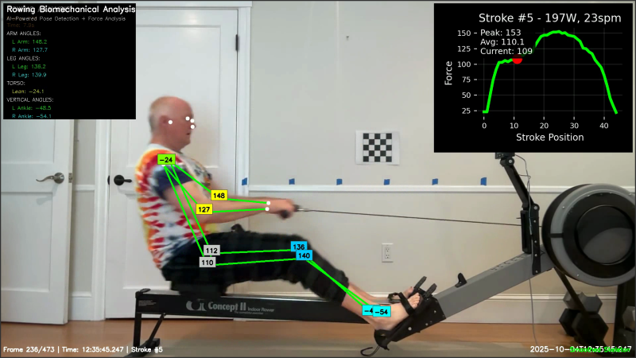

# 🚣‍♂️ Rowing Biomechanical Analysis System

**AI-powered rowing technique analysis with real-time pose detection and force synchronization**



## 🎯 Overview

This system provides comprehensive biomechanical analysis of rowing technique by combining:

- **🎥 Video capture** with embedded timestamps
- **💪 PM5 force data** capture and synchronization  
- **🤖 AI pose estimation** using YOLO11 with advanced smoothing
- **📊 Synchronized overlay videos** with animated force curves and body angles
- **📈 Comprehensive reports** with force-angle correlations

## ✨ Key Features

- **Real-time pose detection** with smooth, stable skeleton overlay
- **Perfect synchronization** between video, force data, and body angles
- **Professional visualization** with color-coded joint angle badges
- **Comprehensive analysis** including stroke-by-stroke breakdowns
- **Export capabilities** for further analysis in Excel, R, Python, or MATLAB

## 🚀 Quick Start

### Installation

```bash
# Clone the repository
git clone https://github.com/yourusername/rowingIA.git
cd rowingIA

# Install dependencies
pip install -r requirements.txt

# Install FFmpeg (required for video processing)
# macOS: brew install ffmpeg
# Ubuntu: sudo apt install ffmpeg
```

### Usage

1. **Connect your Concept2 PM5** via USB and start a workout
2. **Capture data**: `sudo python py3row_usb_video_capture.py`
3. **Row for 2-5 minutes** then stop capture
4. **Analyze**: `python create_complete_kinematics_overlay.py --session-dir py3rowcap_YYYYMMDD_HHMMSS`
5. **Review results** in the generated overlay video and report

## 📊 What You Get

### Overlay Video Features
- **🟢 Smoothed skeleton overlay** - Stable, professional pose detection
- **🎯 Joint angle badges** - Real-time elbow, knee, hip, and ankle angles
- **📈 Animated force curves** - Shows force throughout each stroke
- **⏱️ Perfect synchronization** - Video and force data perfectly aligned

### Analysis Reports
- **Stroke-by-stroke breakdown** - Duration, peak force, power, stroke rate
- **Body angle statistics** - Mean, standard deviation, min, max, range
- **Force-angle correlations** - How body position relates to force output
- **Detailed CSV data** - For further analysis in your preferred tools

## 🛠️ Technical Details

### AI & Computer Vision
- **YOLO11 pose estimation** - State-of-the-art pose detection
- **Advanced smoothing algorithms** - Eliminates jitter and bouncing
- **Confidence-based filtering** - Only uses high-quality detections
- **Outlier rejection** - Removes obviously incorrect poses

### Data Processing
- **Temporal smoothing** - Averages keypoints over multiple frames
- **Gaussian filtering** - Reduces high-frequency noise
- **Force curve analysis** - Combines Drive + Dwelling phases
- **Perfect timestamping** - Frame-accurate synchronization

## 📁 Project Structure

```
rowingIA/
├── py3row_usb_video_capture.py          # Main capture script
├── create_complete_kinematics_overlay.py # Main analysis script
├── requirements.txt                      # Python dependencies
├── SETUP.md                             # Complete setup guide
├── py3rowcap_YYYYMMDD_HHMMSS/           # Capture session directory
└── analysis_py3rowcap_YYYYMMDD_HHMMSS/  # Analysis output directory
```

## 🎛️ Customization

### Smoothing Parameters
Adjust pose smoothing for different stability/responsiveness:

```python
# More stable (slower response)
PoseSmoother(window_size=7, confidence_threshold=0.6, outlier_threshold=2.5)

# More responsive (less stable)  
PoseSmoother(window_size=3, confidence_threshold=0.4, outlier_threshold=1.5)
```

### Model Selection
Choose between different YOLO11 models:
- **yolo11n-pose.pt** - Nano (fastest, good accuracy)
- **yolo11m-pose.pt** - Medium (better accuracy, slower)
- **yolo11l-pose.pt** - Large (highest accuracy, slowest)

## 📋 Requirements

### Hardware
- **Concept2 PM5** rowing machine
- **Computer** with USB port
- **Camera** (webcam or external camera)
- **USB cable** to connect PM5 to computer

### Software
- **Python 3.8+**
- **FFmpeg** for video processing
- See `requirements.txt` for Python dependencies

## 🔧 Troubleshooting

### Common Issues
- **No force data**: Ensure PM5 is in workout mode, check USB connection
- **Poor pose detection**: Improve lighting, position camera for side view
- **Permission denied**: Run capture script with `sudo` for USB access

### Performance Tips
- **Faster processing**: Use shorter video segments (2-5 minutes)
- **Better accuracy**: Ensure good lighting and camera positioning
- **Stable results**: Use consistent rowing pace

## 📚 Documentation

- **[Complete Setup Guide](SETUP.md)** - Detailed installation and usage instructions
- **[Requirements](requirements.txt)** - Python dependencies
- **[Analysis Examples](analysis_py3rowcap_20251004_123520/)** - Sample output files

## 🤝 Contributing

Contributions are welcome! Please feel free to submit a Pull Request.

## 📄 License

This project is licensed under the MIT License - see the LICENSE file for details.

## 🙏 Acknowledgments

- **Ultralytics** for YOLO11 pose estimation models
- **Concept2** for PM5 rowing machine communication
- **OpenCV** for computer vision capabilities
- **Py3Row** for PM5 data capture

---

**Ready to analyze your rowing technique?** 🚣‍♂️

[](https://python.org)
[](https://opencv.org)
[](https://ultralytics.com)
[](LICENSE)
